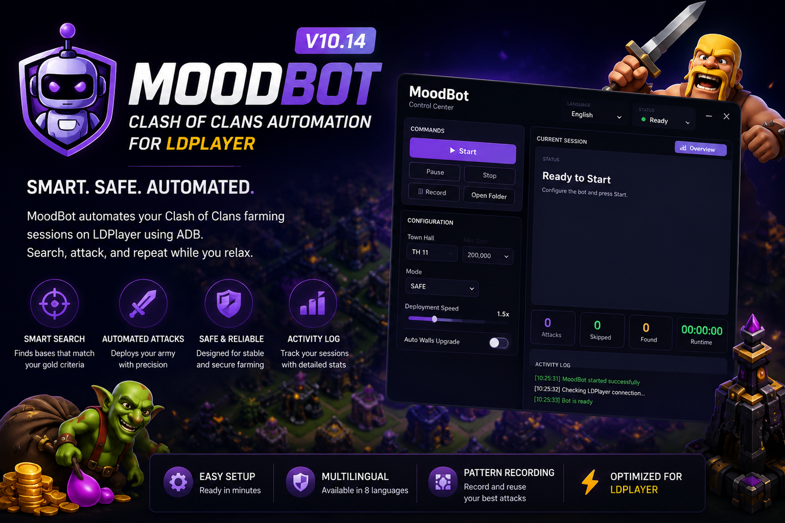

<p align="center">
  
</p>

<h1 align="center">MoodBot V10.14</h1>

<p align="center">
  <strong>Clash of Clans automation for Windows, LDPlayer and ADB</strong><br>
  Multilingual documentation - Updated July 2026
</p>

<p align="center">
  <a href="docs/MoodBot_V10.14_Multilingual_User_Manual.pdf"><strong>Open the complete multilingual user manual</strong></a>
  &nbsp;|&nbsp;
  <a href="docs/README.md"><strong>Documentation index</strong></a>
</p>

> [!IMPORTANT]
> This repository contains public information and documentation only. MoodBot is proprietary software; its application source code, installer, license files and private keys are not publicly distributed here.

## Overview

MoodBot automates repetitive Clash of Clans farming sessions on the LDPlayer Android emulator through ADB. It can search multiplayer bases, read the available gold, skip bases below the configured threshold and reproduce one of the recorded deployment patterns for the selected Town Hall group.

The V10.14 documentation covers license activation, multilingual interface options, light and dark themes, attack recording, optional wall upgrades, random pauses, activity logs and troubleshooting.

## Main features

- Town Hall groups from **TH 1-6** through **TH 13+**
- Minimum-gold filtering from **0 to 2,500,000**
- Navigation profiles: **FAST**, **BALANCED** and **SAFE**
- Deployment playback speed from **1.0x to 6.0x**
- Random selection of recorded `attack_pattern*.json` files
- Built-in recorder for custom attack patterns
- Optional automatic wall upgrades
- Optional random pauses between attacks
- Session counters and detailed Activity log
- Interface available in eight languages
- Light and dark themes
- Hardware-bound license activation through the computer HWID

## Requirements

| Component | Required configuration |
|---|---|
| Operating system | Windows |
| Emulator | LDPlayer, one running instance only |
| Resolution | 1600 x 900 |
| DPI | 240 |
| ADB | Local ADB connection enabled |
| Game language | Clash of Clans must remain in **English** |
| Game state | Standard scenery, clean HOME screen and no open pop-ups |
| Clan Castle | Empty, so additional troops do not move the troop-bar icons |

## First setup in 7 steps

1. Extract the complete MoodBot package to a local writable folder.
2. Start it with `AVVIA_MOODBOT.bat`.
3. Copy the HWID displayed at first launch and send it to the MoodBot creator.
4. Paste the complete personal key beginning with `MB2` and activate the license.
5. Configure LDPlayer to 1600 x 900, 240 DPI and enable the local ADB connection.
6. Start Clash of Clans in English, prepare the correct army and keep the Clan Castle empty.
7. Run the first test with the **SAFE** profile at **1.0x-1.5x**, while monitoring the Activity log.

## Army reference

The army composition and the visible troop-bar order must match the selected group.

| Group | Reference composition |
|---|---|
| TH 1-6 | 20 Giants, 5 Wall Breakers, 20 Barbarians, 20 Archers, 2 Heal spells |
| TH 7-8 | 10 Dragons, 3 Rage, 1 Lightning, 1 hero |
| TH 9-10 | 8 Balloons, 10 Dragons, 4 Rage, 3 Freeze, 2 heroes |
| TH 11 | 8 Balloons, 8 Electro Dragons, 4 Rage, 3 Freeze, 3 heroes |
| TH 12 | Same as TH 11 plus 1 siege machine |
| TH 13+ | 8 Balloons, 10 Electro Dragons, 4 Rage, 3 Freeze, 4 heroes and 1 siege machine |

## Daily operation

Before pressing **Start**, confirm that only one LDPlayer instance is open, the game is on the HOME screen, no pop-up is visible, the army is ready and the selected Town Hall group is correct.

During a session, MoodBot performs the following cycle:

1. Opens multiplayer search.
2. Reads `Available Loot` and compares the gold value with the configured minimum.
3. Skips unsuitable bases or replays a random attack pattern.
4. Waits for the battle to finish.
5. Counts the attack only after the return to HOME is confirmed.

Do not use the mouse or keyboard inside LDPlayer while MoodBot is running. Do not change zoom, resolution, DPI, game language, scenery or troop-bar order during the session.

## Recording a custom attack

1. Stop MoodBot and keep LDPlayer at 1600 x 900 and 240 DPI.
2. Prepare the exact army that will use the new pattern.
3. Open an enemy base manually and leave it ready for deployment.
4. Press **Record** or run `REGISTRA_ATTACCO.bat`.
5. Select the correct group: `th6`, `th7-8`, `th9-10`, `th11`, `th12` or `th13plus`.
6. Record only troop selection, deployment points, spells, heroes, abilities and natural timing.
7. Press `ESC` to finish.

Do not record multiplayer search, `Next`, zoom, pan, swipe, return-to-village actions or clicks used only to focus the emulator window.

Recorded files are stored in:

```text
patterns/th6
patterns/th7-8
patterns/th9-10
patterns/th11
patterns/th12
patterns/th13plus
```

## Documentation

The complete interactive manual contains setup, license activation, interface guidance, army compositions, daily usage, attack recording, pattern management and troubleshooting in eight languages.

[**Open the complete MoodBot V10.14 multilingual user manual (PDF)**](docs/MoodBot_V10.14_Multilingual_User_Manual.pdf)

| Language | Manual pages |
|---|---:|
| Italiano | 2-9 |
| English | 10-17 |
| Espanol | 18-25 |
| Francais | 26-33 |
| Deutsch | 34-41 |
| Portugues | 42-49 |
| Russian | 50-57 |
| Turkish | 58-65 |

A shorter documentation index is available in [`docs/README.md`](docs/README.md).

## Quick troubleshooting

| Problem | First check |
|---|---|
| LDPlayer not found | Open only one emulator instance, start the game and reopen MoodBot |
| ADB unavailable | Enable local ADB, restart LDPlayer and wait for complete loading |
| Pattern missing | Select the correct group and verify that an `attack_pattern*.json` file exists |
| Gold read incorrectly | Use English, 1600 x 900, 240 DPI, standard scenery and no overlays |
| Wrong troop icon clicked | Check army composition, troop-bar order, heroes and empty Clan Castle |
| Pattern too fast | Reduce playback to 1.0x-2.0x or record it again with longer pauses |
| Bot stuck in battle | Stop it, return manually to HOME, close pop-ups and restart in SAFE mode |

Before closing MoodBot after an error, copy the Activity log and save it together with a screenshot of LDPlayer.

## Availability and support

MoodBot is a paid proprietary tool and is not publicly downloadable from this repository.

- Telegram: `@michmood`
- Email: `moodbotcoc@gmail.com`

## Disclaimer

Automation may violate the rules or Terms of Service applicable to the game or account. Use MoodBot under your own responsibility.

This project is not affiliated with, endorsed by or sponsored by Supercell. Clash of Clans is a trademark of Supercell Oy.
